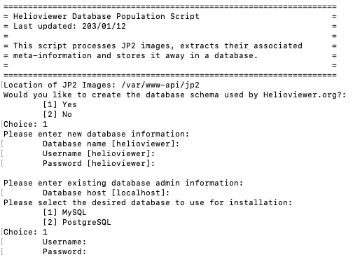

# HelioViewer Docker
This repo provides a containerized development environment for working with HelioViewer

# Installation
Open a terminal and clone this repository.
```bash
git clone https://github.com/dgarciabriseno/helioviewer-dev-docker.git
```

Pull the helioviewer sources with the following commands
```bash
git submodule update --init --recursive --remote
```

You may also want to change the remotes for the submodules if you have a fork that
you want them to point to. To do this, edit the .gitmodules file to point to your fork
and then run the following:
```bash
git submodule sync
git submodule update --init --recursive --remote
```

Next, get the sample data from [here](http://helioviewer.org/jp2/archives/sample-data.tgz)
and extract it to a folder named sample-data in this folder. After extraction
your folder structure should look like this:
```
- api
- helioviewer.org
- sample-data
| - AIA
| - HMI
- other files...
```

Next, to build the container, run Docker and then execute the following command:
```bash
docker build -t helioviewer-dev:latest .
```

Now spin up the container using the provided run.sh
*Note* - if you have different paths for any folders (api, helioviewer.org, or sample-data)
or if you built the container with a different name, then you can specify these in run.sh
```bash
./run.sh
```

Once the container is running, open it in Docker. To complete the setup,
run the provided install.sh script located in /root this will setup the database
and complete installation so the container is ready to go.
```bash
cd /root
./install.sh
```

When prompted, enter the following:
- For Location of JP2 Images: /var/www-api/jp2
- Enter [1] to create the database schema
- Leave the fields blank for Database name, username, and password to use the defaults
- Leave database host as localhost
- Enter [1] for desired database to select MySQL
- Enter root for username, leave password blank.

The prompt should look like this:


At this point the development container is all set up.
Any changes you make to the api, helioviewer.org, and sample-data folders
will be reflected in the container.

You can access the site by going to http://localhost:8080/?debug=True

# Other Notes
- The run script assumes you will be using ports 8080 and 8081. Modify the docker run command in
  run.sh if you need to change this.
- The container does not automatically start the required services when it powers on. You may
  run the startup.sh script whenever you start the container to enable these services.
